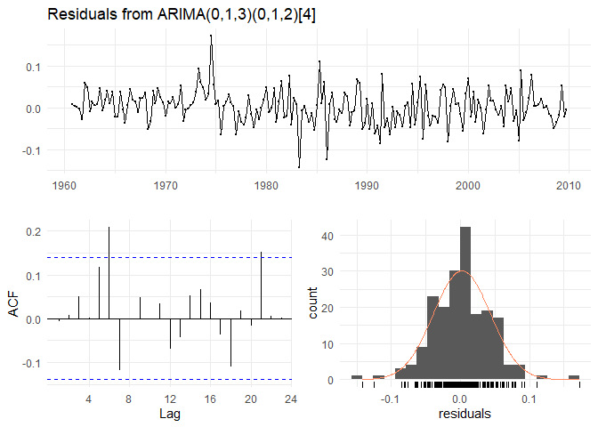

Goals and Procedure
-------------------

The aim of this short project was to investigate the behavior of
statistical time-series models and their mathematical assumptions. Main
subject of this study are ARIMA and SARIMA models that were used to
understand the relationship between consumption and GDP in Australia.

Furthermore, the performance of the models was compared to ETS, TBATS,
Average. DR+ARIMA etc. The results indicated, that DR+ETS approaches
performed best considering the given data.

Including Plots
---------------

You can also embed plots, for example:

Note that the `echo = FALSE` parameter was added to the code chunk to
prevent printing of the R code that generated the plot.
