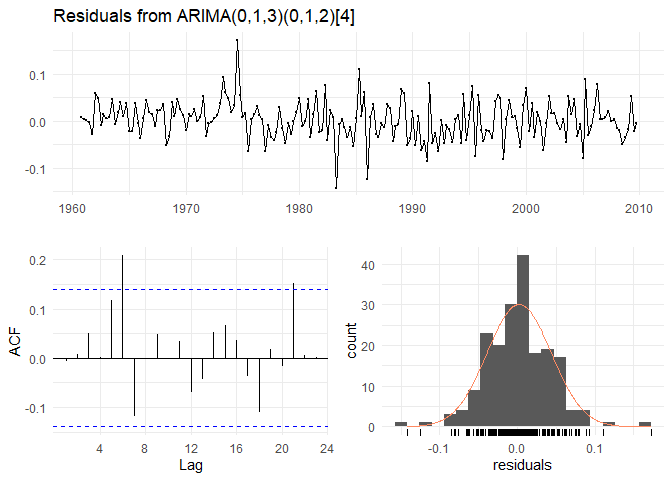

Goals and Procedure
-------------------

The aim of this short project was to investigate the behavior of
statistical time-series models and their mathematical assumptions. Main
subject of this study are ARIMA and SARIMA models that were used to
understand the relationship between consumption and GDP in Australia.
Additionally, forecast combinations were derived to identify further
modelling variants.

Furthermore, the performance of the models was compared to ETS, TBATS,
Average. DR+ARIMA etc. The results indicated, that DR+ETS approaches
performed best considering the given data.

Applied Methodologies (excerpt)
-------------------------------

1.  Analysis of Trend, Seasons, and Spurious Regression Issues (KPSS,
    ADF)
2.  Stationarity Analysis
3.  Autocorrelation and Residual Analysis
4.  Box-Cox Transformation

(0,1,2)-1.png)

Because in our `fit4` model (see *Appendix*, *Figure 28*) we still have
some issues with autocorrelation we set `P` = 1 because of the trend
that can still be observed in the residuals. We design and end up with
an ARIMA(2,1,2)(1,1,1) model that also surpasses all previous models in
terms of coefficient significance, and AICc, AIC, and BIC. Also the
Ljung-Box p-value is maximized, the residual distibution feed the ARIMA
process requirements, and the unit root theorem is also satisfied, as
seen in *Figures 6 to 8*:

| model               |  LB.p.value|      aicc|       bic|
|:--------------------|-----------:|---------:|---------:|
| ARIMA(2,1,2)(1,1,1) |       0.081|  -666.195|  -644.001|
| ARIMA(2,1,3)(0,1,2) |       0.046|  -663.645|  -638.372|
| ARIMA(1,1,3)(0,1,2) |       0.024|  -664.072|  -641.878|
| ARIMA(2,1,2)(0,1,1) |       0.007|  -664.195|  -645.104|
| ARIMA(1,1,1)(0,1,2) |       0.002|  -660.958|  -641.867|

### Automated ARIMA Selection Approach

Because KPSS can only be used to determine `d` and `D`, we need to
employ Information Criteria, such as AICc, to pick the correct
`p`,`q`,`P`,`Q` values. This is already incorporated in the automated
ARIMA model selection that calculates different ARIMA models and picks
the best models based on those Informaiton Criteria. In fact, the same
ARIMA(2,1,2)(1,1,1) is picked, based on the unit root space optimization
to guarantee stationarity.

Comparison of ACF and PACF with ARIMA and Raw Consumption Expenditure
---------------------------------------------------------------------

Comparing the ACF and PACF plots of the raw Final consumption
Expenditure and ARIMA data, we can observe the following: 1) The
autocorrelation in the residuals is resolved. This was important to
resolve, as ARIMA assumes that historical patterns will not change
during the forecast. 2) The issue of a high PACF spike at lag 1,
indicating correlation between the error terms of consumption between
different lags was resolved. This is important to resolve, because ARIMA
assumes uncorrelated future errors.

ARIMA Forecast on Test Data Set
-------------------------------

As can bee seen in *Figure 10*, the manual ARIMA model fits the data
quite well, despite some minor overestimation. The prediction interval
increases in size throughout time because of the included differences
method.

Dynamic Regression with Explanatory Variable
--------------------------------------------

### Manual Dynamic Regression Model Selection

The inclusion of a new explanatory variable in the ARIMA model requires
us to check the errors terms of the regression model (eta) and our ARIMA
model (epsilon). In our case, our two variables for consumption and
income are cointegrated. That’s why we can rely on non-stationary time
series (Hyndman & Athanasopoulos, 2018). In our first model, that is
already adjusted with `d` = `D` = 1, as we observed with the KPSS test
before in order to guarantee non-stationarity of the data, we still
observe significant ACF spikes for lag 1,3, and 4 (see *Appendix, Figure
29*), suggesting a `Q`-value of 1. PACF spikes for lag 1,3, and 4 also
indicate that `P` = 1. Coefficients and AICc, and BIC values will be
showed at the end.

This setting shows us significant ACF and PACF spikes for lags 2 and 3
as well as 6 (see *Figure 11*) and potential for improvement for the
distribution of residuals (see *Appendix, Figure 30*). We set `p` = `q`
= 2, as in the previous model to balance the ACF and PACF values against
each other. This results in optimal models considering ACF/PACF and
white-noise behaviour, residual distribution, heteroscedasticity,
stationarity, and coefficient significance (see *Figure 12* and *Figure
13*). When looking at the coefficients, we observe that `ma1` and
`xreg`, are not significant, but we include the latter because of the
task. We do not delete `ma1`, as this would impact the significant `ma2`
coefficient and because of the needed transformation towards
autocorrelation decrease.

    ## Series: ts.train[, 2] 
    ## Regression with ARIMA(2,1,2)(1,1,1)[4] errors 
    ## Box Cox transformation: lambda= 0.1175096 
    ## 
    ## Coefficients:
    ##           ar1      ar2     ma1     ma2    sar1     sma1  xreg
    ##       -0.3616  -0.6468  0.2254  0.8424  0.4516  -0.7876     0
    ## s.e.   0.1287   0.0902  0.1156  0.0646  0.0976   0.0926   NaN
    ## 
    ## sigma^2 estimated as 0.001732:  log likelihood=340.5
    ## AIC=-665   AICc=-664.21   BIC=-638.94

    ## 
    ##  Ljung-Box test
    ## 
    ## data:  Residuals from Regression with ARIMA(2,1,2)(1,1,1)[4] errors
    ## Q* = 6.8499, df = 3, p-value = 0.07684
    ## 
    ## Model df: 7.   Total lags used: 10

This reestimation yields in a suitable model, considering the white
noise type of ARIMA residuals, ACF and PACF specifics, as well as a
fitting residual distribution that is only slightly skewed because of
the observation outliers during the financial crisis in 2007/08.
Additionally, we could include a constant in order to mimick the trend
that is displayed in our regression residuals (see *Figure 14*). For
this, and because a drift cannot be included if the order of difference
\> 2, we must set d = 0 and also q = 0, because this drift should
explain the information conveyed in the regression residuals. But
because this change yields in more autocorrelation, we refrain from
doing so.

### Automated ARIMA Model Selection

On the other side, the automated approach yields in a different model
variation, that was already discussed above but discarded because of its
negative impact on ACF and PACF plots and white-noise properties. It
yields a lower AICc and does not yield in autocorrelation reduction, as
seen in *Figure 15*. In sum, the automated dynamic regression model is a
worse forecast model than our ARIMA(2,1,2)(1,1,1) model, as can be seen
in *Figure 16*.

    ## 
    ##  Ljung-Box test
    ## 
    ## data:  Residuals from Regression with ARIMA(1,1,1)(0,0,2)[4] errors
    ## Q* = 86.72, df = 3, p-value < 2.2e-16
    ## 
    ## Model df: 6.   Total lags used: 9

| model               |  LB.p.value|      aicc|       bic|
|:--------------------|-----------:|---------:|---------:|
| ARIMA(2,1,2)(1,1,1) |       0.077|  -664.214|  -638.941|
| ARIMA(0,1,0)(1,1,1) |       0.000|  -654.671|  -641.855|
| ARIMA(0,1,0)(0,1,0) |       0.000|  -618.404|  -611.953|
| ARIMA(1,1,1)(0,0,2) |       0.000|  -441.553|  -419.202|

Forecast Combination: Comparison, Plotting and Measurment
---------------------------------------------------------

In the following part, we will combine different forecasting models and
assess its performance. Specifically, we will test 3 different cases in
forecasting combination:

1.  ARIMA model combined with the dynamic regression(DR). In this
    scenario, we will combine our best performing ARIMA model (in our
    case, it is `ARIMA(2,1,2)(1,1,1)[4]`) and same ARIMA model with the
    specified `xreg` parameter.

2.  AutoARIMA with regression model and manually picked ARIMA with
    regression. Previously, the automated model has been compared with
    the manually adjusted one, and we have seen the advantage of the
    manual approach. Yet, it is interesting to see the performance of
    the combined model and to compare it to other variations of the
    forecast combination.

3.  Manual ARIMA with regression and TBATS/ETS In this case, we want to
    combine the best performing ARIMA model with other forecasting
    approaches. In this case, for the comparison, we decided to compare
    the combination with ETS and TBATS models.

Every forecast combination has two variations: averaged forecast
combination and using optimal weights. Optimal weights have been
calculated by the following formulas:
$w=\\frac{\\sigma\_{2}^{2}-\\sigma\_{12}}{\\sigma\_{1}^{2}+\\sigma\_{2}^{2}-2\\sigma\_{12}}$
and
$1-w=\\frac{\\sigma\_{1}^{2}-\\sigma\_{12}}{\\sigma\_{1}^{2}+\\sigma\_{2}^{2}-2\\sigma\_{12}}$

*Table 3* below provides the comparison of both sole and combined models
and measures of ME, RMSE and MAE for the test set. In the performance
assessment and comparison, we are primarily looking at the RMSE,
therefore, the ordered comparison of the model performance can be seen
in the *Figure 20* below.

|                              |          ME|       RMSE|        MAE|
|:-----------------------------|-----------:|----------:|----------:|
| ARIMA(2,1,2)(1,1,1)          |  -13759.711|  19936.764|  15383.120|
| ARIMA(1,1,1)(0,0,2) with reg |  -43648.055|  53350.354|  43648.055|
| ARIMA(2,1,2)(1,1,1) with reg |  -12602.044|  18709.743|  14461.070|
| ETS                          |   10403.266|  11609.098|  10403.266|
| TBATS                        |  -26308.101|  45426.611|  29673.195|
| Averaged ARIMA+DR            |  -13180.878|  19321.676|  14922.095|
| Optimal weights: ARIMA+DR    |  -13174.158|  19314.554|  14916.743|
| Averaged: DRs(auto+manual)   |  -28125.049|  35716.730|  28273.289|
| Optimal: DRs(auto+manual)    |  -24235.763|  31356.277|  24496.598|
| Averaged: DR + ETS           |   -1099.389|   5187.795|   4445.283|
| Optimal weights: DR + ETS    |    3370.362|   4198.252|   3444.653|
| Averaged: DR + TBATS         |  -19455.072|  31831.652|  21922.485|
| Optimal weights: DR + TBATS  |  -17181.374|  27391.689|  19445.203|

As for the first combination case, where the ARIMA model is combined
with the same model with regression, we can observe that the RMSE for
the sole models is comparably close. So, in fact, there is no direct
need to combine the forecasts, as the performance of the combined models
and sole models will differ just slightly.

From the *Figure 17*, we can see that all of the forecasting models
perform almost equally as good, with just a slight advantage of the
ARIMA(2,1,2)(1,1,1) with regression. This can be explained with the fact
that both models are providing forecasts with estimations “above” the
actual forecast and with a slight difference comparing to the models we
will observe in the following two cases. Also, the 4 forecast are
incredibly similar because they are all based on ARIMA(2,1,2)(1,1,1)
model.

For the second combination, we decided to combine `auto.arima` with
regression and manually adjusted model with regression, used in the
previous case. As we previously observed, the difference between both
cases is observable with the measured RMSE of 19351.334 and 52235.143,
for the manual and auto models correspondingly.

From the *Figure 18*, presented above, we can observe the similar
pattern as in the previous case: combination model with optimal weights
performs slightly better than the averaged model, yet the sole manually
adjusted model is still seen as the best performer due to both forecasts
laying above the actual data of the test set.

In the previous cases, we have looked into the combination of the
different variations of the ARIMA models that we have estimated in the
for the previous tasks. All of them share similar characteristics being
above the test set in terms of forecast and primarily varying in the
“closeness” to the actual data and capturing of the seasonality
(especially visible in the last case). However, it is interesting to see
the difference between the ARIMA models and other estimation approaches.
For this case, we have made forecasting using TBATS and ETS models both
separately combining with the best performing ARIMA model with
regression.

From *Figure 19* above, we can see that TBATS model and ARIMA with
regression are very similar in its estimations, which is logical as far
as TBATS is similar to the dynamic harmonic regression in many aspects,
apart from seasonality. Different estimation characteristics are
observed for the ETS (M,A,M): the model itself performs very well for
based on the training set, and we can see that it captures data trend
and seasonality quite well. Apart from that, ETS estimations are mapped
slightly below the actual data, which should be very beneficial in the
combination of two models.

The results of the combined models can be found in the lower part of the
*Figure 19*. High performance of the forecast combination can be
observed: a combination of the ARIMA with ETS has the best results among
all models. Applying the use of the optimal weights, allows us to
enhance the model even further, producing the overall RMSE of 4098.904.
TBATS model forecast combination with ARIMA is weaker, due to the
aforementioned estimation characteristics of TBATS. In the *Figure 20*
below, we can see that overall TBATS model, as with many automated
modelling frameworks, performs rather poorly with just a slighter better
estimation, than autoARIMA.

From *Figure 20*, we can see the overall comparison of all the models
(combined and sole) performance based on the RMSE. Noticeably, the
combination of two different best performing sole models (ARIMA with
regression and ETS), provides us with the best results. In particularly
this case, the poor performance of the automated modelling frameworks is
visible with TBATS and autoARIMA having the biggest RMSE. In all the
cases of forecasts combination, the advantage of the application of the
optimal weights over averaging can be mentioned.

ARIMA Comparison
----------------

    ## 
    ##  Ljung-Box test
    ## 
    ## data:  Residuals from ARIMA(0,1,3)(0,1,2)[4]
    ## Q* = 15.086, df = 3, p-value = 0.001745
    ## 
    ## Model df: 5.   Total lags used: 8

    ## 
    ##  Ljung-Box test
    ## 
    ## data:  Residuals from ARIMA(1,1,3)(0,1,2)[4]
    ## Q* = 9.4732, df = 3, p-value = 0.02362
    ## 
    ## Model df: 6.   Total lags used: 9

    ## 
    ##  Ljung-Box test
    ## 
    ## data:  Residuals from ARIMA(2,1,3)(0,1,2)[4]
    ## Q* = 8.0037, df = 3, p-value = 0.04594
    ## 
    ## Model df: 7.   Total lags used: 10

    ## 
    ##  Ljung-Box test
    ## 
    ## data:  Residuals from ARIMA(2,1,2)(0,1,1)[4]
    ## Q* = 11.993, df = 3, p-value = 0.007406
    ## 
    ## Model df: 5.   Total lags used: 8

    ## 
    ##  Ljung-Box test
    ## 
    ## data:  Residuals from ARIMA(2,1,2)(1,1,1)[4]
    ## Q* = 6.7349, df = 3, p-value = 0.08084
    ## 
    ## Model df: 6.   Total lags used: 9

    ##                 model LB.p.value     aicc      bic
    ## 1 ARIMA(2,1,2)(1,1,1)      0.081 -666.195 -644.001
    ## 2 ARIMA(2,1,3)(0,1,2)      0.046 -663.645 -638.372
    ## 3 ARIMA(1,1,3)(0,1,2)      0.024 -664.072 -641.878
    ## 4 ARIMA(2,1,2)(0,1,1)      0.007 -664.195 -645.104
    ## 5 ARIMA(1,1,1)(0,1,2)      0.002 -660.958 -641.867

Note that the `echo = FALSE` parameter was added to the code chunk to
prevent printing of the R code that generated the plot.
